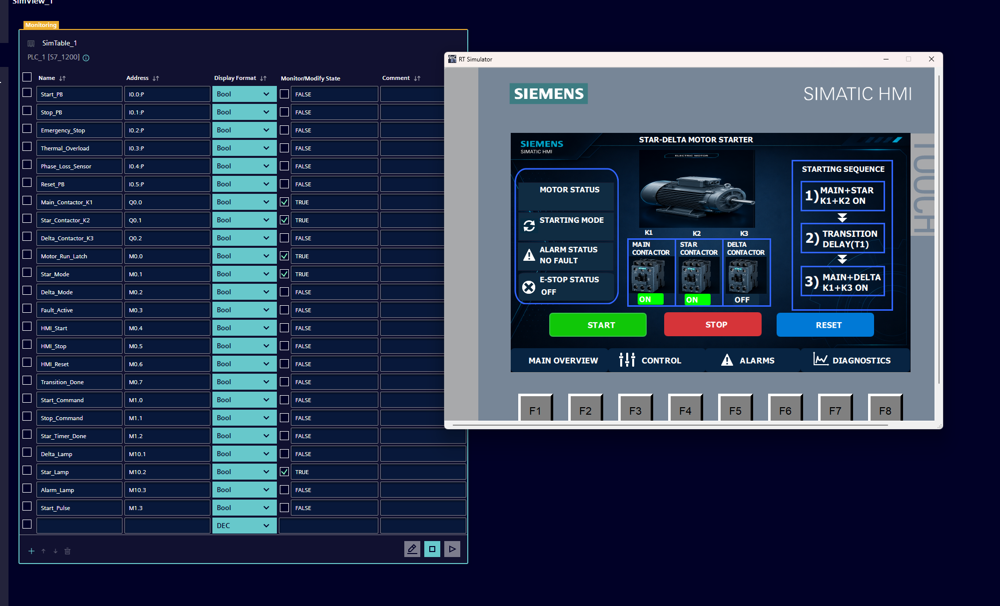
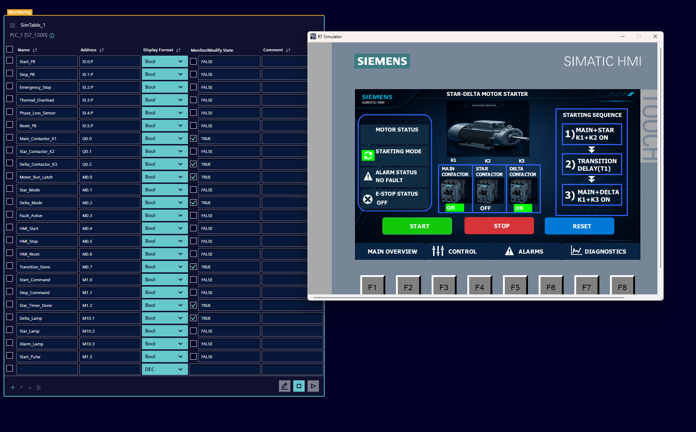
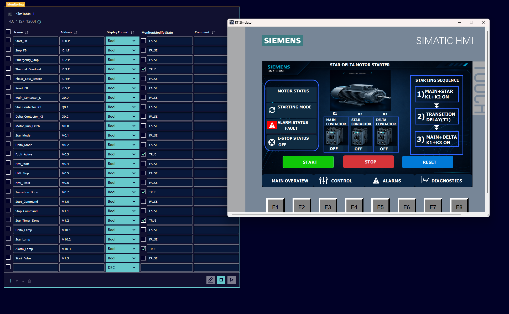
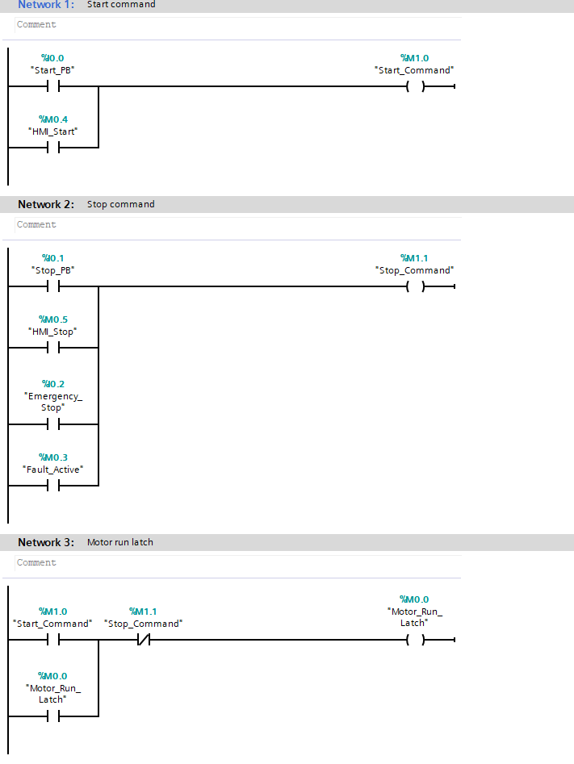
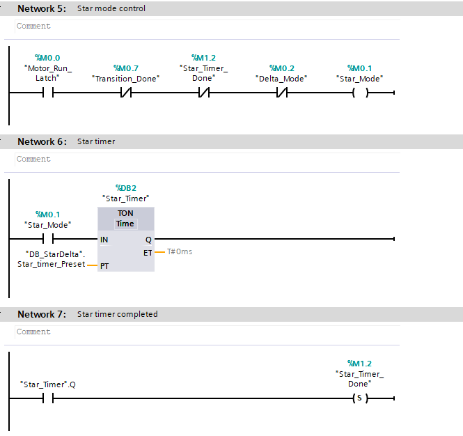
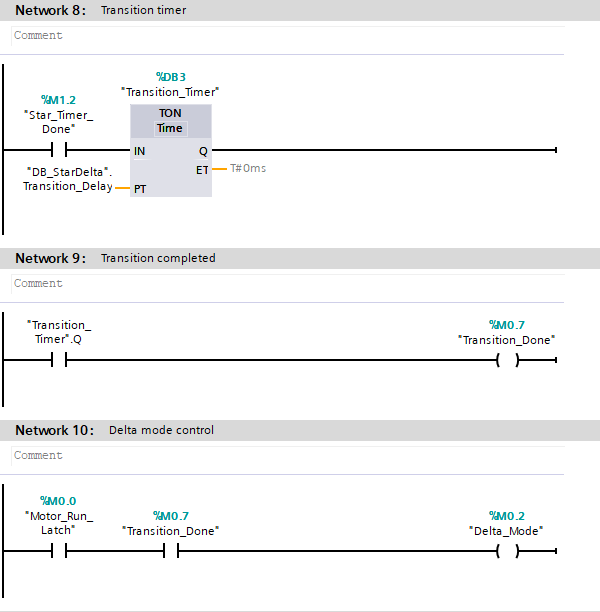
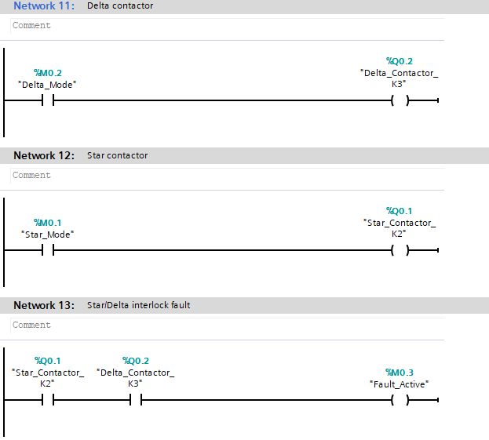
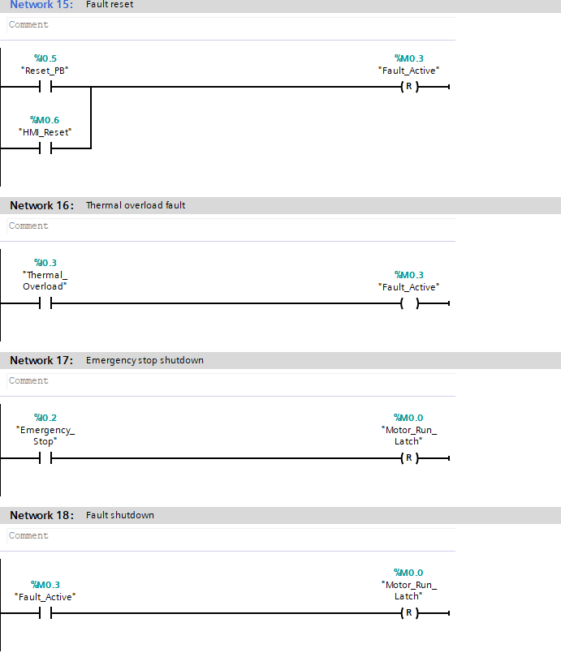

# Industrial Star-Delta Motor Starter | Siemens TIA Portal

Industrial PLC project developed using **Siemens TIA Portal V20**, **S7-1200 PLC**, **WinCC HMI**, and **Siemens PLCSIM**.

This project simulates an industrial Star-Delta motor starter with automatic startup sequence, fault protection, operator control, and HMI monitoring.

---

# Features

- Physical Start / Stop Push Buttons
- HMI Start / Stop Control
- Motor Run Latch
- Automatic Star-Delta Starting Sequence
- Adjustable Star Timer
- Adjustable Transition Delay
- Main Contactor Control (K1)
- Star Contactor Control (K2)
- Delta Contactor Control (K3)
- Emergency Stop Protection
- Thermal Overload Protection
- Star/Delta Interlock Fault Detection
- Manual Fault Reset
- Status Lamps
- WinCC HMI Monitoring
- PLC Simulation using Siemens PLCSIM

---

# Hardware & Software

## PLC

- Siemens S7-1200 CPU 1214C DC/DC/DC

## Software

- Siemens TIA Portal V20
- Siemens WinCC
- Siemens PLCSIM V20

---

# Operating Sequence

1. Start button is pressed.
2. Main Contactor (K1) energizes.
3. Star Contactor (K2) starts the motor.
4. Star Timer expires.
5. Transition Delay is executed.
6. Delta Contactor (K3) energizes.
7. Motor continues running in Delta mode.

---

# Safety Functions

- Emergency Stop
- Thermal Overload Protection
- Star/Delta Interlock Detection
- Automatic Fault Shutdown
- Manual Fault Reset

---

# Project Files

The complete Siemens TIA Portal V20 project is included in this repository.

Project contains:

- PLC Program (LAD)
- WinCC HMI
- Data Blocks
- Timers
- Simulation Configuration

---

# Project Gallery

## HMI - Star Mode

---

## HMI - Delta Mode

---

## HMI - Thermal Overload

---

## HMI - Emergency Stop

---

## HMI - Stop Button

---

## PLC Logic - Start / Stop / Run Latch

---

## PLC Logic - Star Mode & Timer

---

## PLC Logic - Star-Delta Transition

---

## PLC Logic - Contactors & Interlock

---

## PLC Logic - Fault Protection

---

# Validation

The PLC logic has been fully implemented and validated using Siemens PLCSIM.

The available HMI screens demonstrate:

- Star Mode
- Delta Mode
- Thermal Overload Alarm
- Emergency Stop
- Operator Controls
- Contactor Status
- Alarm Status

---

# Technologies

- Siemens TIA Portal V20
- Siemens S7-1200
- Ladder Logic (LAD)
- Siemens WinCC
- Siemens PLCSIM
- Industrial Automation
- Motor Control
- Star-Delta Starter
